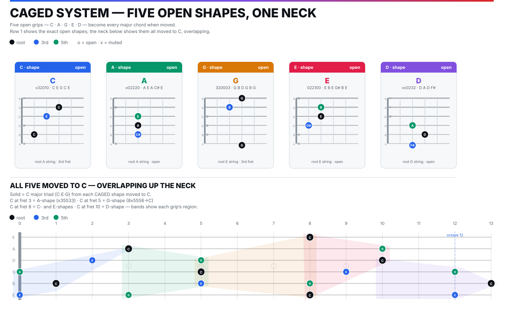

> [How To Jazz Guitar](<./How To Jazz Guitar.md>) / 1. CAGED

# 1. CAGED — The Neck Tiled

Five open grips chain and tile the neck with no gaps. The nut is just a barre at fret 0.

**Map:** `caged-system.svg` — top row = five exact open grips; bottom = all five moved to **C**, overlapping bands. Keep it open for the next four chapters.

### Open grips — the exact stacks

| Shape | Grip low→high | Notes | Root |
|-------|---------------|-------|------|
| **C** | `x32010` | `C E G C E` | A-string fret 3 |
| **A** | `x02220` | `A E A C# E` | A open |
| **G** | `320003` | `G B D G B G` | low E fret 3 |
| **E** | `022100` | `E B E G# B E` | low E open |
| **D** | `xx0232` | `D A D F#` | D open |

Each is `0 4 7` semitones (`R M3 P5`, major triad `C= C(0) E(4) G(7)`). Same intervals, different string set — that is why they are interchangeable.

*Drill:* strum → arpeggiate low→high→low naming `1-3-5-1-3` → reform without looking. 5 reps, eyes closed on the 5th.

### Five Cs — one chord, five places

Move each grip so its root is **C**:

* **C-shape** `0` : `x32010` = C open — region `0–4`.
* **A-shape** `3` : `x35533` barred at 3 — `A3:C / D5:G / G5:C / B5:E / e3:G` — region `3–6`.
* **G-shape** `5` : `8x5558` (`C G C E C`, A muted) on `E8:C` — region `5–8`.
* **E-shape** `8` : `8 10 10 9 8 8` barred at 8 — `E8:C / A10:G / D10:C / G9:E / B8:G / e8:C` — region `8–10`.
* **D-shape** `10` : `xx101312` (`D10:C / G12:G / B13:C / e12:E`) — region `10–13`.

In `caged-system.svg` bottom neck these are the colored bands blue→green→amber→red→purple, solid `C·E·G`. Play them ascending `C→A→G→E→D` then descending, 4 beats each at 70 BPM — one octave of neck, one pitch collection.

**Root hunting:** pick a fret (say 5). Nearest CAGED roots are `A-shape` at 3 and `G-shape` at 8. This orientation *is* fretboard knowledge.

### Warm-up tune: Hey Joe

`Hey Joe` = `| C | G | D | A | E |` — circle of fifths descending, one CAGED root per bar. Use it to chain shapes, not as repertoire (that comes in Ch 6).

*Comp one chorus with one string-set* (all `E-shapes` barred), next chorus all `A-shapes`. You learn to see *progression* independent of position — the jazz skill.

> **Checkpoint:** play C major in 5 places, name the shape at any fret, comp Hey Joe without the diagram.

---
← [Prev](./00-Key-to-Learning-FAST.md) · [Index](<./How To Jazz Guitar.md>) · [Next](./02-Scales-Modes.md) →
