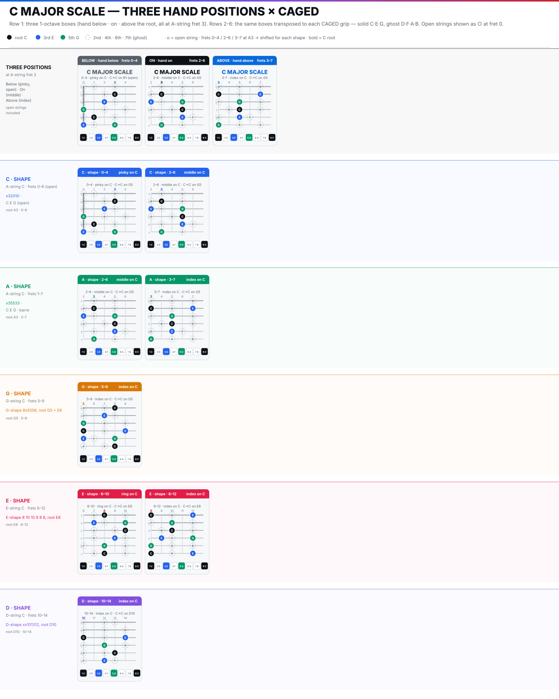

> [How To Jazz Guitar](<./How To Jazz Guitar.md>) / 2. Scales & Modes

# 2. Scales & Modes — One Box, Seven Sounds

### Three positions at A3

There are only 3 practical fingering for scales where the hand is positioned below, on or above the root note.

**Below — pinky on C — frets 0–4, open strings**
Card `BELOW 0–4` (`c-major-scale-caged.svg:26`) — `○` at fret 0. Folk/open region, connects to C-shape.

**On — middle on C — frets 2–6, the reference**
Card `ON 2–6` (`:81`) — `C at A3` under middle finger, octave `C at G5`. Solid `C(3) E(2) G(5)`.
Fingering: index 2, middle 3, ring 4, pinky 5/6.

**Above — index on C — frets 3–7**
Card `ABOVE 3–7` (`:133`) — `C at A3` under index, A-shape/G-shape region.

### CAGED transpositions

Rows 2–6 of `c-major-scale-caged.svg` show all of the CAGED shapes with ghost notes where the scale tones fit. Depending on how you play the underlying chord and where you are going with the next chord, there is generally only 1 or maybe 2 fingerings that make sense. You are not learning new scales — you are seeing the same `0 2 4 5 7 9 11` pattern tile the neck where the chords tile.

Basically, you want to learn how to play the C major scale in all the CAGED positions first. Eventually, you will extend the scale to the top and bottom strings to form 2 octave modal scales.
### The five useful modes

Modes are just labels for which note of a scale to start on. For example, C major - all the modes have the exact same notes but if you start on C it's major and if you start on A it's natural minor. Start the *same box* on a different root:

| Mode | On | Map | Color | Fast-track use |
|------|----|-----|-------|----------------|
| **Ionian (major)** | C | `0 2 4 5 7 9 11` — `1 2 3 4 5 6 7` | major | `Imaj7`, `IVmaj7` home |
| **Dorian** | D | `0 2 3 5 7 9 10` — `1 2 ♭3 4 5 6 ♭7` | minor | **`ii7`** — the jazz minor (`Dm7` in C) |
| **Phrygian** | E | `0 1 3 5 7 8 10` — `1 ♭2 ♭3 4 5 ♭6 ♭7` | minor | **`iii7`** — the hand-position workhorse (`Em7` in C) |
| **Mixolydian** | G | `0 2 4 5 7 9 10` — `1 2 3 4 5 6 ♭7` | dominant | **`V7`** — `G7→C` |
| **Aeolian** | A | `0 2 3 5 7 8 10` — `1 2 ♭3 4 5 ♭6 ♭7` | minor | `vi7` / relative |

Ignore `Lydian/Locrian` for now (Lydian `#11` comes later with Altered).

**Why Phrygian is a cheat code:** put your hand in Phrygian position (E Phrygian at `A7` / fret 7 — `Em7` box `7-9-7-8` from `c-major-scale-caged.svg` `Em` row). Without moving your hand you already cover **six diatonic chords**: `iii7 Em7 (E)`, `IVmaj7 Fmaj7 (F)`, `V7 G7 (G)`, `vi7 Am7 (A)`, `viiø Bø7 (B)`, and `Imaj7 Cmaj7 (C)` — degrees `3, 4, 5, 6, 7, 8` are all in the window `7–10` under four fingers. In `on 2–6` Ionian you get `1–5`; in `Phrygian 7–10` you get `3–8`. Combine two hand positions (`on` + `Phrygian`) and the whole diatonic set is under two grips, no shifts. That is the fastest way to comp `iii–vi–ii–V–I` progressions (`Em7 Am7 Dm7 G7 Cmaj7`) staying put.

*Pivot — same hand, new root:* stay in `on 2–6` box. Play `C→C` (Ionian), then start/end on `D at A5` → `D Dorian` (`D E F G A B C D`), then on `G` → `G Mixolydian`. The diagram does not change — your *hearing of 1* does. Now move to `Phrygian 7–10` at `A7`: start/end on `E` → `E Phrygian` (`E F G A B C D E`). Same box shape as Ionian, new root.

*Exercise — ii-V-I in one box:* loop `| Dm7 | G7 | Cmaj7 |` (C major). Play `D Dorian → G Mixolydian → C Ionian` without moving your hand. You just did chord-scale playing.

*Exercise — six chords, one grip:* stay in `Phrygian` position `7–10` (hand at fret 7, root `E` at `A7`). Play `Em7 → Fmaj7 → G7 → Am7 → Bø7 → Cmaj7` ( `iii IV V vi vii° I` ) 2 beats each at 70 — all six without shifting. Now play `| Em7 Am7 | Dm7 G7 | Cmaj7 |` — `iii-vi-ii-V-I` — first two chords in Phrygian, last three in `on 2–6`; one hand move covers the whole turnaround.

> **Checkpoint:** 1-oct × 3 positions + 2-oct middle, and `Dm7-G7-Cmaj7` staying in one box by shifting root hearing.

---
← [Prev](./01-CAGED.md) · [Index](<./How To Jazz Guitar.md>) · [Next](./03-Diatonic-Harmony.md) →
