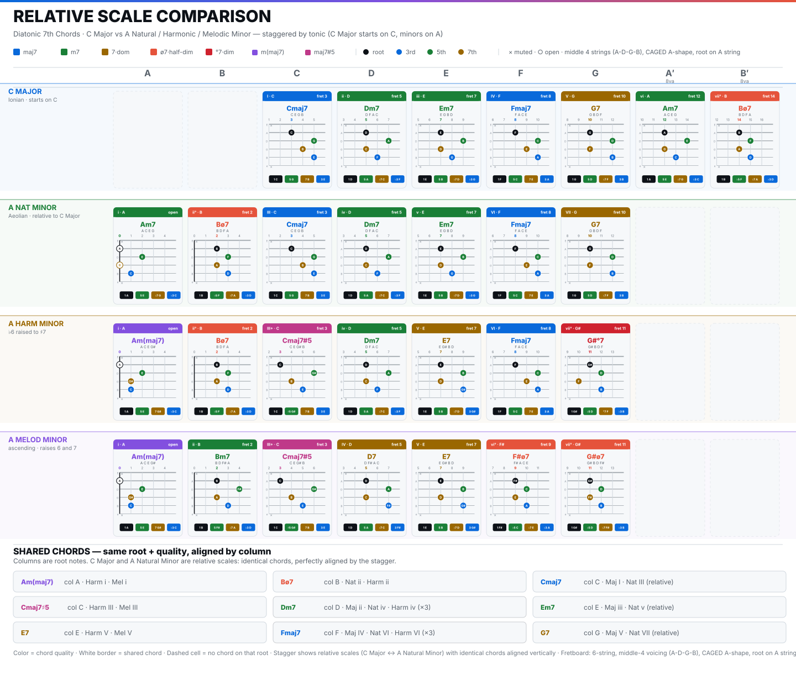

> [How To Jazz Guitar](<./How To Jazz Guitar.md>) / 3. Diatonic Harmony

# 3. Diatonic Harmony — Triads, 7ths, Function

Stack thirds on each scale degree. In C major you get seven 7th chords that are all diatonic:

| Degree | Chord | Symbol | Stack | Map | Notes |
|--------|-------|--------|-------|-----|-------|
| I | Cmaj7 | Δ7 | R M3 P5 M7 | `0 4 7 11` | `C E G B` |
| ii | Dm7 | m7 | R ♭3 P5 ♭7 | `0 3 7 10` | `D F A C` |
| iii | Em7 | m7 | same | same | `E G B D` |
| IV | Fmaj7 | Δ7 | `0 4 7 11` | `F A C E` |
| V | G7 | 7 | R M3 P5 ♭7 | `0 4 7 10` | `G B D F` |
| vi | Am7 | m7 | `0 3 7 10` | `A C E G` |
| vii° | Bø7 | ø7 | R ♭3 ♭5 ♭7 | `0 3 6 10` | `B D F A` |

This is descriptive (`what it is`). Function (`what it does`, Riemann `T/S/D`) is: `T = I vi iii`, `S = ii IV`, `D = V vii°`. `S` prepares `D`, `D` resolves to `T`. Cadences: `V→I` authentic, `IV→I` plagal, `V→vi` deceptive.

**Diagram:** `scale-comparison.svg` rows 1/3 — full `1·3·5·7` middle-4 `A-D-G-B` (CAGED A-shape, outer `E/e` muted `×`).

### A-shape diatonic 7ths up the neck — C major

Middle-4 = `A(1) D(5) G(7) B(3)` — frets `root / 5th / 7th / 3rd` per card (window `root±2`):

* `I·C` 3 `Cmaj7 3-5-4-5` = `A3:C / D5:G / G4:B / B5:E` → `C G B E`
* `ii·D` 5 `Dm7 5-7-5-6` = `A5:D / D7:A / G5:C / B6:F`
* `iii·E` 7 `Em7 7-9-7-8` = `A7:E / D9:B / G7:D / B8:G`
* `IV·F` 8 `Fmaj7 8-10-9-10` = `F C E A`
* `V·G` 10 `G7 10-12-10-12` = `G D F B` (`♭7 F`)
* `vi·A` 12 `Am7 12-14-12-13` = `A E G C`
* `vii°·B` 14 `Bø7 14-15-13-15` = `B F A D` (`♭5 F`)

*Comp:* `| Cmaj7 | Dm7 | Em7 | Fmaj7 | G7 | Am7 | Bø7 | Cmaj7 |` staying in A-shape middle-4, 2 beats each at 60. Hear quality change while grip stays.

Triads are the same without the 7th (`1·3·5`): `C Dm Em F G Am B°` — same fret addresses, `G` string holds `3rd` instead of `7th`.

### Relative minor preview

`scale-comparison.svg` staggers `C major` at `C` vs `A natural minor` at `A` (relative, same notes). Cards shift: `A Nat Minor i Am7 (open ×0-2-1-1)`, `A Harm Minor` raises `G→G#` (maj7 on `i`), `A Mel Minor` raises `F→F#` + `G→G#`. This is why `C↔Am` pivots `{Dm, F, Am, B°}` work — all four are diatonic to both keys, tonic/dominant `{C, Em, G}` excluded. Preview for BH minor where `G→G#` matters.

> **Checkpoint:** diatonic 7ths in C A-shape clean, can name `I ii V vi` function by ear.

---
← [Prev](./02-Scales-Modes.md) · [Index](<./How To Jazz Guitar.md>) · [Next](./04-Shells-Voicings.md) →
