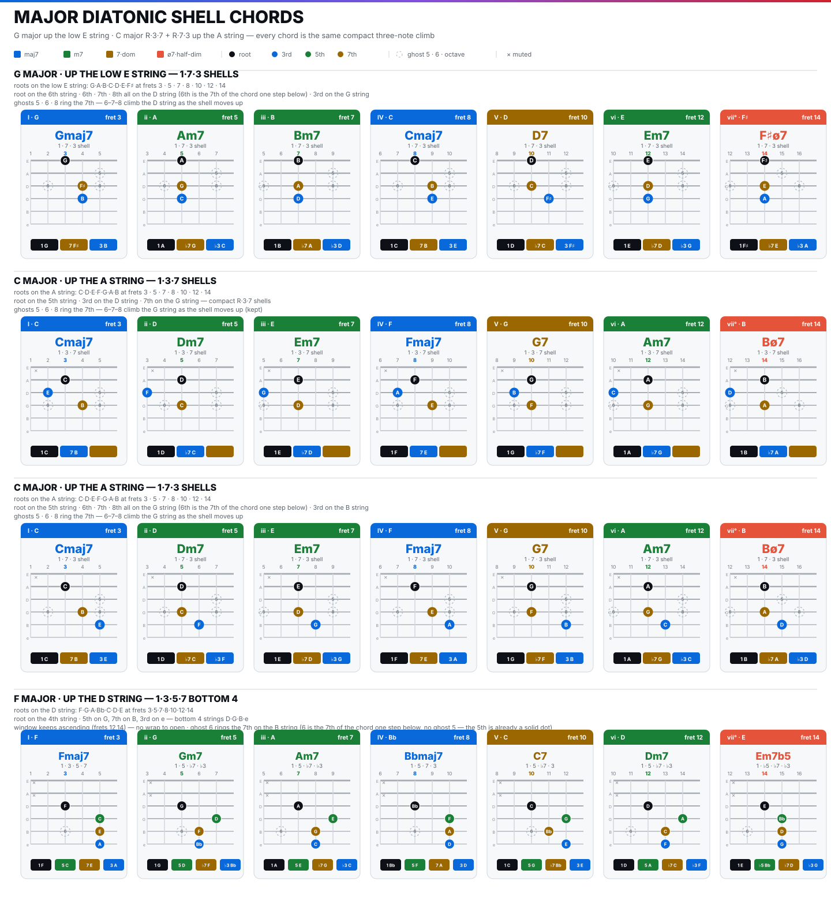

> [How To Jazz Guitar](<./How To Jazz Guitar.md>) / 4. Shells & Voicings

# 4. Shells & Voicings Everywhere

Full `1·3·5·7` is informative; `1·7·3` is *functional*. Drop the 5th — the shell still tells major/minor/dominant, it voice-leads by semitone, and it leaves room for a soloist or pianist. This chapter reduces, then moves.

### Shell logic — 1·7·3 on one bass string

*Geometry:*
* Root on `A` string → `7th` on `G` (`G4/B` at `154`), `3rd` on `B` (`B5/E` at `176`). Ghosts `5/6/8` (`G` on `D5`, `A`, `C`) dashed on `G/D` climb as you ascend — `6` is the `7th` of the chord a step below.
* Root on low `E` → `7th` on `D`, `3rd` on `G`. Same interlock.

### C major shells walking the A string

`sheel?` — `shell-chords.svg:32` row `C MAJOR · UP THE A STRING` frets `3 C ·5 D ·7 E ·8 F ·10 G ·12 A ·14 B`:

* `I C` 3 `Cmaj7` = `A3:C / G4:B / B5:E` → `1 C, 7 B, 3 E`
* `ii D` 5 `Dm7` = `A5:D / G5:C / B6:F` → `1 D, ♭7 C, ♭3 F`
* `iii E` 7 `Em7` = `A7:E / G7:D / B8:G`
* `IV F` 8 `Fmaj7` = `A8:F / G8:E / B10:A` — etc.
* `V G` 10 `G7` = `A10:G / G10:F / B12:B`
* `vi A` 12 `Am7` = `A12:A / G12:G / B13:C`
* `vii° B` 14 `Bø7` = `A14:B / G14:A / B15:D`

*Voice-leading lab:* play `Cmaj7→Dm7→Em7→Fmaj7` as shells. Watch `B string 3rd`: `E5→F6→G8→A10` stepwise; `G string 7th`: `B4→C5→D7→E9` stepwise. That stepwise motion *is* the scale inside the chords.

*Apply:* comp `Hey Joe` with shells: `C maj7 3 → G7 10 → D7 5` — same changes, jazz sound, 3 notes.

### G major shells walking the low E

`shell-chords.svg:359` row `G MAJOR · UP THE LOW E` frets `3 G ·5 A ·7 B ·8 C ·10 D ·12 E ·14 F#`:

* `I G` 3 `Gmaj7` = `E3:G / D4:F# / G4:B`
* `ii A` 5 `Am7` = `E5:A / D5:G / G5:C`
* `iii B` 7 `Bm7` = `E7:B / D7:A / G7:D`
* `IV C` 8 `Cmaj7` = `E8:C / D8:B / G8:E` etc.

Same degrees, new bass string — E-shape CAGED.

### F major — D-shape + top-4

`F = F G A B♭ C D E` (`B♭`). Same 7 chords, two higher registers:

* **D-shape** (root on `D`): shell root on `D`, up the `D` string `F3 G5 A7 B♭8 C10 D12 E14`. Full `1·3·5·7` top-leaning.
* **Top-4 `D-G-B-e`** (root on `D`, `1·3·5·7` like `Fmaj7 3-5-5-5 → D3:F / G5:C / B5:A / e5:E`). This is modern comping — tight, trebly, leaves `E/A` for bass. Both sets use same 7 chord maps, new string-set.

*Fast-track takeaway:* `C major A-shape` gives you `G major E-shape` and `F major D/top-4` by transposition, not memorization. `3 keys × 2–3 sets × 7 chords = 42 grips`, 7 patterns moved.

> **Checkpoint:** `C` and `G` shells ascending/descending at 80, naming `1 ♭7 ♭3` without diagram.

---
← [Prev](./03-Diatonic-Harmony.md) · [Index](<./How To Jazz Guitar.md>) · [Next](./05-Barry-Harris.md) →
