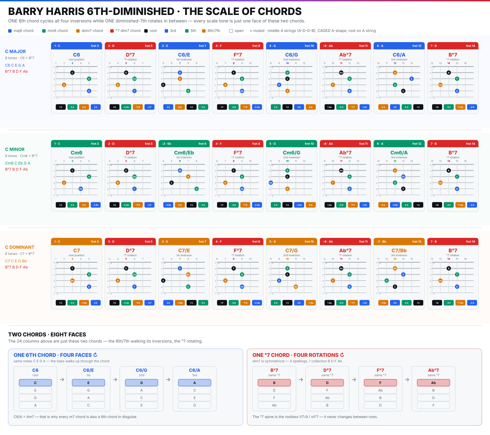

> [How To Jazz Guitar](<./How To Jazz Guitar.md>) / 5. Barry Harris

# 5. The Barry Harris System

Harris: a **6th (or 7th) chord + the °7 a half-step below** contain all 8 notes of the 6th-diminished scale. Alternate `6 → °7 → 6 → °7...` — every scale degree becomes a chord tone. One 6th cycles 4 inversions; one °7 cycles 4 rotations, but `B°7 = D°7 = F°7 = A♭°7` (same `0 3 6 9` pcs).

**8-tone scales:**

* **Major 6-dim:** `C6 C E G A + B°7 B D F Ab` = `{C D E F G Ab A B}` = `1 2 3 4 5 ♭6 6 7`
* **Minor 6-dim:** `Cm6 C E♭ G A + B°7` = `{C D E♭ F G Ab A B}`
* **Dominant 6-dim:** `C7 C E G B♭ + B°7` = `{C D E F G Ab B♭ B}`

With 0–3 chromatic passes `B→B♭→A→Ab→G` descending, chord tones land on beats (half-step rule).

**Maps:** `bh-scale-of-chords.svg` (24 cards middle-4 `A-D-G-B` for `C` — Rosetta stone) + `dim-6th-major.svg` / `dim-6th-minor.svg` / `dim-6th-dominant.svg` (3 roots `G/C/F` × 3 string-sets).

### C major 6-dim — middle 4 (A-D-G-B)

`bh-scale-of-chords.svg:28` row `C MAJOR — C6 + B°7` monotonic `3,5,7,8,10,11,12,14`:

* `1·C` 3 `C6` = `A3:C / D5:G / G2:A / B5:E` → `C G A E`
* `2·D` 5 `D°7` = `A5:D / D6:Ab / G4:B / B6:F`
* `3·E` 7 `C6/E` 1st inv = `A7:E / D7:A / G5:C / B8:G` → `E A C G`
* `4·F` 8 `F°7` = `A8:F / D9:B / G7:D / B9:Ab`
* `5·G` 10 `C6/G` 2nd inv = `A10:G / D10:C / G9:E / B10:A`
* `♭6·Ab` 11 `Ab°7` = `A11:Ab / D12:D / G10:F / B12:B`
* `6·A` 12 `C6/A` 3rd inv = `A12:A / D14:E / G12:G / B13:C`
* `7·B` 14 `B°7` = `A14:B / D15:F / G13:Ab / B15:D`

Pattern: `C6 →°7→ C6 →°7...` Every `C6` is `C E G A` rotated; every `°7` is `B D F Ab` rotated.

*Drill:* 60 BPM, 2 beats each ascending `C6(3)→D°7(5)→C6/E(7)→F°7(8)→C6/G(10)→Ab°7(11)→C6/A(12)→B°7(14)` then descending. Watch `G` string `2→4→5` chromatic `A→B`.

### C minor 6-dim — middle 4

`bh-scale-of-chords.svg:33` row `C MINOR — Cm6 C E♭ G A + B°7` frets `3,5,6,8,10,11,12,14` — `E→E♭` at `B5`:

* `1·C` 3 `Cm6` = `A3:C / D5:G / G2:A / B5:E♭` → `C G A E♭`
* `♭3·E♭` 6 `Cm6/E♭` = `A6:E♭ / D7:A / G5:C / B8:G`
* Remaining `°7`s identical — spine unchanged.

*Toggle drill:* `C6(3) ↔ Cm6(3)` — one fret `E↔E♭` on `B5` — hear major→minor.

### C dominant 6-dim — middle 4

`bh-scale-of-chords.svg:38` row `C DOMINANT — C7 C E G B♭ + B°7` frets `3,5,7,8,10,11,13,14` (13 not 12 to stay monotonic):

* `1·C` 3 `C7` = `A3:C / D5:G / G4:B♭ / B5:E` → `C G B♭ E` (`♭7 B♭` on `G4`)
* `3·E` 7 `C7/E` = `A7:E / D8:B♭ / G5:C / B8:G`
* `♭7·B♭` 13 `C7/B♭` = `A13:B♭ / D14:E / G12:G / B13:C`

*Use:* `G7` 6-dim (`dim-6th-dominant.svg` `G7` low-E `3 G B D F`) → `Cmaj7` — `F→E` (`♭7→3`) resolution, the `V→I` sound.

### Three string-sets, three roots

* **Top-4 `D-G-B-e`** (3rd row per root in `dim-6th-major.svg` etc.) — root on `D`, muted `E/A`. Brighter, trio-friendly. `C major` top-4 `C6` etc. at ~fret 5–10.
* **Bottom-4 `E-A-D-G`** (Row 1 per root, CAGED E-shape, root on low `E`, muted `B/e`) — fat low comp. `G major` bottom-4: `3 G6 G B D E →5 A°7 →7 G6/B →8 C°7 →10 G6/D →11 E♭°7 →12 G6/E →14 F#°7` (`dim-6th-major.svg:28`). Minor bottom-4 `Gm6 G B♭ D E` and dominant `G7 G B D F` follow same addresses, one note altered.

Each step moves one voice by half-step — the neck *shows* voice-leading.

### How to use

1. **Harmonize the scale:** play 8-chord scale ascending as block chords — every scale tone harmonized, no wrong notes.
2. **Half-step rule:** descending, add `B→B♭→A→Ab→G` so chord tones land on beats.
3. **Comp standards:** replace each `| Cmaj7 | Am7 | Dm7 | G7 |` with its 6-dim scale (`C6`, `Am6 = A C E F# + G#°7`, `Dm6`, `G7` scales). The `°7` is connective tissue: `C6/A(12)→B°7(14)→Cmaj7` = `I→vii°→I`.

> **Checkpoint:** `C6→D°7→C6/E` middle-4 blind, plus same scale low-E for `G` and top-4 for `F`.

---
← [Prev](./04-Shells-Voicings.md) · [Index](<./How To Jazz Guitar.md>) · [Next](./06-Repertoire-Lab.md) →
