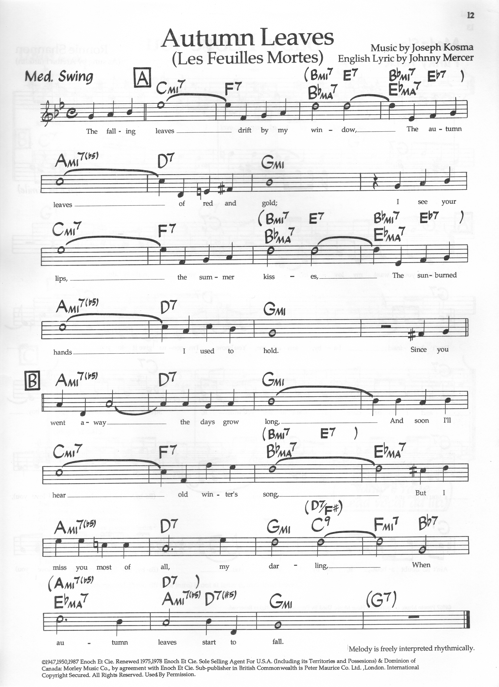

> [How To Jazz Guitar](<./How To Jazz Guitar.md>) / [6. Repertoire Lab](./06-Repertoire-Lab.md) / Autumn Leaves

# 2. Autumn Leaves — G Minor / E♭ Major — 32-Bar

**Concert:** G minor (relative E♭ major) — `AABA` often played as `| Cm7 F7 | B♭maj7 E♭maj7 | Am7♭5 D7 | Gm |`.

**Concert changes (G minor key center):**
```
| Cm7  | F7   | B♭maj7 | E♭maj7 |
| Am7♭5| D7   | Gm     | Gm     |
| Cm7  | F7   | B♭maj7 | E♭maj7 |
| Am7♭5| D7   | Gm     | Gm     |
```

**Why — the course anchor:** `ii-V-I` in *major* (`Cm7 F7 B♭`, bars 1–3) *and* `iiø-V-i` in *minor* (`Am7♭5 D7 Gm`, 5–7). Relative modulation `C↔Am` pivots `{Dm F Am B°}` in one tune. Tests `Cm6` vs `C6` BH contrast.

**Map:** Middle-4 `A-D-G-B` `Cm7 3?` → `Gm` shells `G10?` Actually in concert G minor, `Gm` root `A10` etc. For practice, drill in **C minor/E♭** first (your `C` shell set: `Cm7 at A3`, `Fm7 at A8` etc.), then transpose −10 frets to `G` for concert (or −3 to `A3→G`).

**BH:**
* `Cm7 F7 B♭maj7` → `E♭ major` area: use `B♭6` scale `B♭ D F G + A°7` and `E♭6` `E♭ G B♭ C`.
* `Am7♭5 D7 Gm` → minor: `Gm6` scale `G B♭ D E + F#°7` (`Gm6` at `A10` bottom-4) + `D7` scale `D F# A C + C#°7`.

**Scale:** `B♭ Ionian` over `Cm7 F7 B♭` (or `C Dorian`), `G Aeolian` (`G A B♭ C D E♭ F`) over `Am7♭5 D7 Gm` — or `G melodic minor` `G A B♭ C D E F#` for `D7` altered.



---
← [Prev](./06-01-C-Jam-Blues-All-Blues.md) · [Index](<./How To Jazz Guitar.md>) · [Next](./06-03-All-Of-Me.md) →
