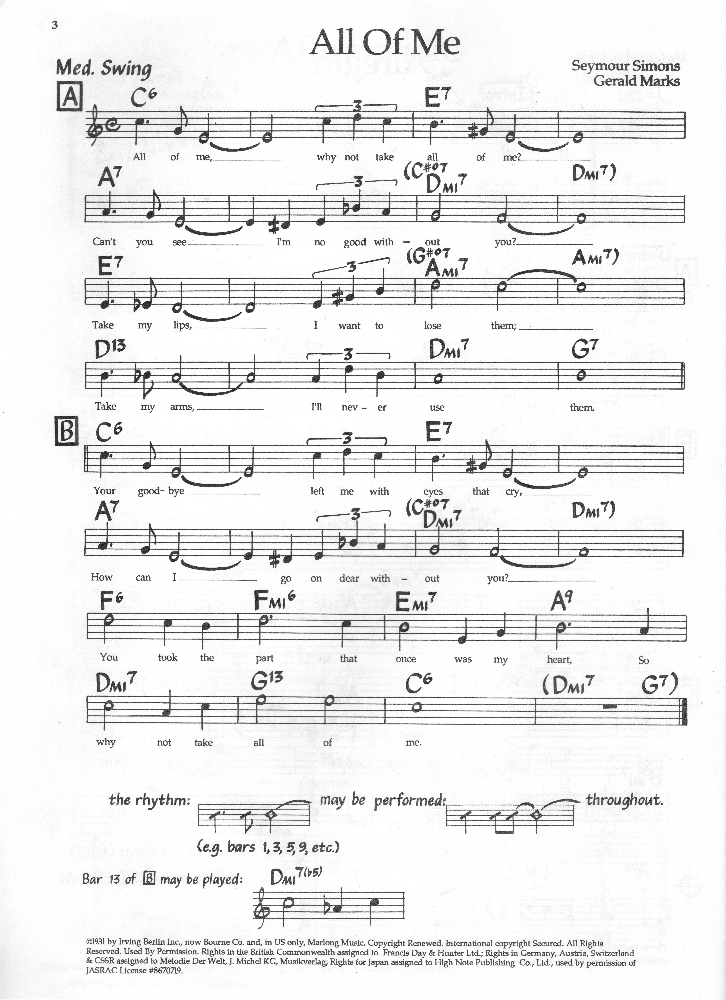

> [How To Jazz Guitar](<./How To Jazz Guitar.md>) / [6. Repertoire Lab](./06-Repertoire-Lab.md) / All Of Me

# 3. All Of Me — C Major — 32-Bar ABAC

**Concert:** C major — matches the lead sheet. Classic `I → tonicizations`, no transpose needed.

**Concert changes (lead sheet, 32 bars — 8 per line):**
```
| C6   | C6   | E7   | E7   |   (A: I → V7/vi)
| A7   | A7   | Dm7  | Dm7  |   (V7/ii → ii; sheet writes C#°7 passing into Dm7)
| E7   | E7   | Am7  | Am7  |   (V7/vi → vi; sheet writes G#°7 passing into Am7)
| D13  | D7   | Dm7  | G7   |   (V7/V → V → ii–V turnaround)
| C6   | C6   | E7   | E7   |   (B = A reprise)
| A7   | A7   | Dm7  | Dm7  |
| F6   | Fm6  | Em7  | A9   |   (IV → iv → iii–VI turnaround)
| Dm7  | G13  | C6   | C6   |   ((Dm7 G7) turnaround on repeat)
```
Footnote on sheet: bar 29 `Dm7` may be played `Dm7♭5` (diatonic `iiø` color before `G13`).

**Why:** Descending chain of secondary dominants — every dominant tonicizes the next chord (`E7→A7→Dm→E7→Am→D7→G7→C`, then `F6→Fm6→Em7→A9→Dm7→G13→C6`). Drills moving shells **by fourths** (`G7 shell at 10 → Cmaj7 at 3` = same intervallic move), plus the `F6→Fm6` major→minor toggle and two written BH diminished passings.

**Map:** Straight onto your **C** shell set — no transpose. `C6 at A3` (`bh-scale-of-chords.svg:28`), `E7 at A7`, `A7 at A12` (or low-E `A5`), `Dm7 at A5`, `Am7 at A12`, `D7 at A5`, `G7 at A10`, `F6 at A8`, `Fm6` same fret one-fret toggle (`A→A♭`).

**BH:** Each dominant is its own 6-dim scale: `E7` scale `E G# B D + D#°7`, `A7` `A C# E G + G#°7`, `D7` `D F# A C + C#°7`, `G7` `G B D F + F#°7` (`dim-6th-dominant.svg`). The handwritten `(C#°7 → Dm7)` and `(G#°7 → Am7)` on the sheet *are* the BH move — `°7` a half-step below the target. `F6→Fm6` (`F A C D → F A♭ C D`) is the major→minor one-fret toggle from Ch 5.

**Scale:** `C Ionian` home with `Mixolydian` on each `7` bar; `E7` bar carries `G#` (`V7/vi`, A harmonic-minor flavor), `A7` bar carries `C#` (`V7/ii`), `D13` bar = `D Mixolydian`.



---
← [Prev](./06-02-Autumn-Leaves.md) · [Index](<./How To Jazz Guitar.md>) · [Next](./06-04-All-The-Things-You-Are.md) →
