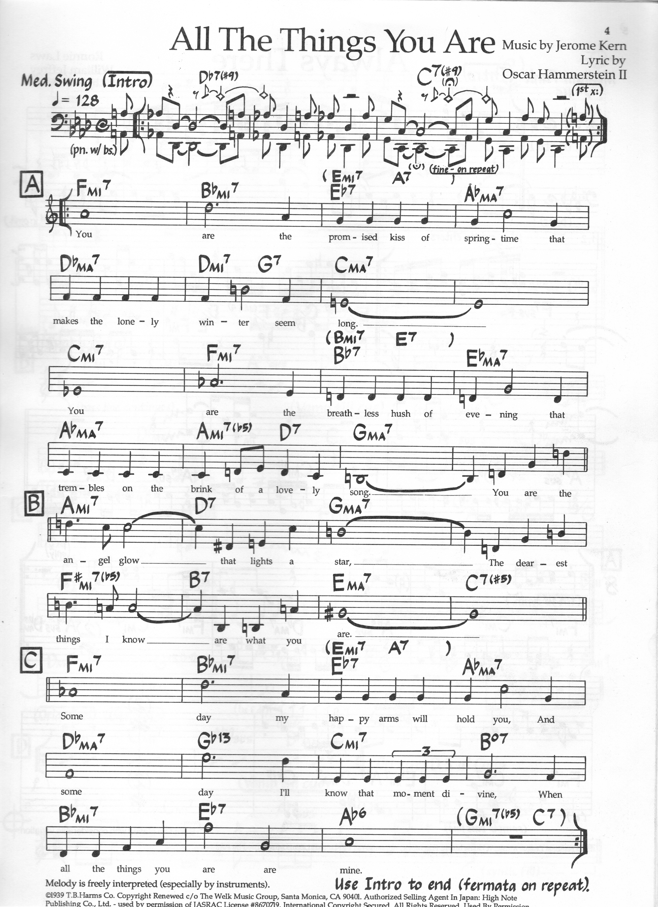

> [How To Jazz Guitar](<./How To Jazz Guitar.md>) / [6. Repertoire Lab](./06-Repertoire-Lab.md) / All The Things You Are

# 4. All The Things You Are — A♭ → C → E — 36-Bar

**Concert:** A♭ major → C major → E major → ... (cycle of fourths / Coltrane-ish before Coltrane). 36 bars.

**Concert changes (first 16):**
```
| Fm7 | B♭m7  | E♭7  | A♭maj7 |
| D♭maj7 | Dm7 | G7 | Cmaj7 |
| Cmaj7 | Bm7 | E7  | Amaj7 |
| Amaj7 | A♭m7| D♭7 | G♭maj7 | (→ etc.)
```

**Why:** *Key-center tune.* Every `ii-V` resolves a fourth higher, landing in a new key (`Fm7→B♭7→E♭`, then `D♭→Cmaj7` = chromatic mediant). Tests CAGED tiling — same `ii-V-I` grip design moved through `F→E♭→A♭→D♭→C→A→G♭`. Also first `Lydian` hint (`C Ionian` vs `C Lydian` `#11` on `E♭→G` `G→Dm`).

**Map:** Middle-4 `A-D-G-B` `Fm7 at 1?` Actually `Fm7` root `A8?` `F at A8` — use your `F` shell set (`F G A B♭ C D E`) directly. For practice, isolate `Fm7 B♭7 E♭maj7` as one `ii-V-I` at `F8` in your `F` set.

**BH:** Each `maj7` → its `6` scale (`A♭6`, `D♭6`, `Cmaj7→C6`, `Amaj7→A6`); each `7` → its dominant scale (`E♭7`, `G7`, `E7`). The `Bm7 E7 Amaj7` is a `ii-V-I` in A — use `A6` scale.

**Scale:** `F Dorian → B♭ Mixolydian → E♭ Ionian` (bars 1–4) — same box move you drilled in Ch 2 `ii-V-I` but now the `I` becomes `ii` of the next key.



---
← [Prev](./06-03-All-Of-Me.md) · [Index](<./How To Jazz Guitar.md>) · [Next](./06-05-Blue-Bossa.md) →
