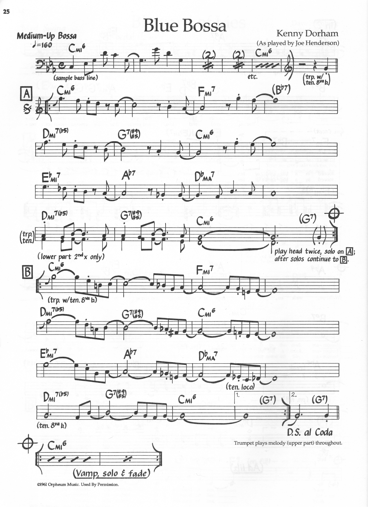

> [How To Jazz Guitar](<./How To Jazz Guitar.md>) / [6. Repertoire Lab](./06-Repertoire-Lab.md) / Blue Bossa

# 5. Blue Bossa — C Minor → D♭ Major — 16-Bar Bossa

**Concert:** C minor (concert) — bossa.

**Concert changes:**
```
| Cm7 | Cm7 | Fm7 | Fm7 |
| Dm7♭5| G7 | Cm7 | Cm7 |
| E♭m7| A♭7 | D♭maj7 | D♭maj7 |
| Dm7♭5| G7 | Cm7 | Dm7♭5 G7 |
```

**Why:** 16-bar, `iiø-V` in minor (`Dm7♭5 G7 Cm7`, bars 5–7) + `ii-V` in major (`E♭m7 A♭7 D♭`, 9–11) in one tune. Direct `Cm6` BH use (`Cm6 C E♭ G A`) vs `Cm7`, and `ø7` test.

**Map:** Practice in `C minor` exactly — your `C` shell/BH `Cm6` at `A3` (`bh-scale-of-chords.svg:33` `Cm6 3`, `D°7 5`, `Cm6/E♭ 6`). In concert it *is* in C minor — no transpose.

**BH:** `Cm7` bars → `Cm6` scale `C E♭ G A + B°7`; `Fm7` → `Fm6` `F A♭ C D + E°7`; `Dø G7` → `G7` scale `G B D F + F#°7`.

**Scale:** `C Dorian` (`C D E♭ F G A B♭`) over `Cm7`, `C melodic minor` `C D E♭ F G A B` over `Dm7♭5 G7` for altered `G`.



---
← [Prev](./06-04-All-The-Things-You-Are.md) · [Index](<./How To Jazz Guitar.md>) · [Next](./06-06-Tune-Up.md) →
