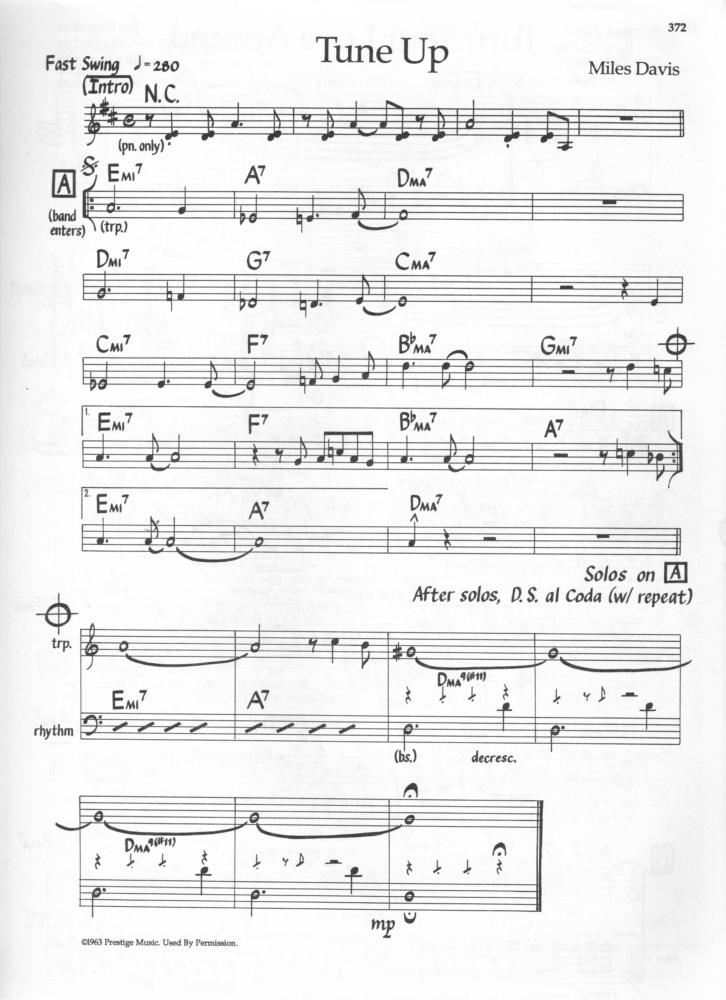

> [How To Jazz Guitar](<./How To Jazz Guitar.md>) / [6. Repertoire Lab](./06-Repertoire-Lab.md) / Tune Up

# 6. Tune Up — D Major → C → B♭ → D — 16-Bar Etude

**Concert:** D major etude by Miles — four `ii-V-I`s descending whole step.

**Concert changes:**
```
| Em7 | A7 | Dmaj7 | Dmaj7 |
| Dm7 | G7 | Cmaj7 | Cmaj7 |
| Cm7 | F7 | B♭maj7| B♭maj7 |
| Em7 | A7 | Dmaj7 | Dmaj7 |
```

**Why:** *Transposition etude.* Same `ii-V-I` design moved `D→C→B♭→D`. Drills the Chapter 3→4 workshop: take `D` `A-shape` `Em7 5?` actually `D` root `A5`, then `C` root `A3`, then `B♭` root `A1` — identical grip, new fret.

**Map:** Start in **D** (`A5` root) with `Em7 A7 Dmaj7` at `5/7/5`, slide −2 frets to `C` (`Dm7 G7 Cmaj7` at `3/10/3`), −2 to `B♭` (`Cm7 F7 B♭maj7` at `1/8/1`).

**BH:** Each `maj7` → its `6` scale: `Dmaj7→ D6` (`D F# A B`), `Cmaj7→C6`, `B♭maj7→B♭6`; each `7` → dominant: `A7` `A C# E G + G#°7`.

**Scale:** `E Dorian → A Mixolydian → D Ionian` (first 4 bars) — Ch 2 pivot in loop.



---
← [Prev](./06-05-Blue-Bossa.md) · [Index](<./How To Jazz Guitar.md>) · [Next](./06-07-Oleo-Rhythm-Changes-Basic.md) →
