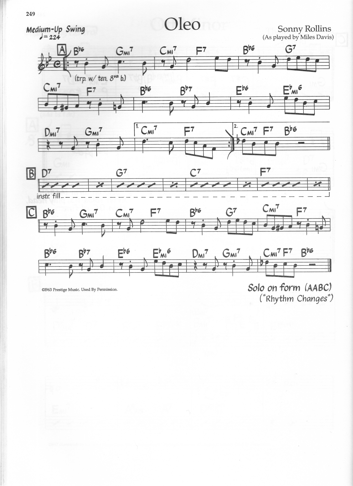

> [How To Jazz Guitar](<./How To Jazz Guitar.md>) / [6. Repertoire Lab](./06-Repertoire-Lab.md) / Oleo

# 7. Rhythm Changes — Basic — B♭ Major — 32-Bar AABA (Oleo)

**Concert:** B♭ major — the jazz `AABA`.

**Concert changes (A 8 bars):**
```
| B♭maj7 | G7   | Cm7  | F7   |
| B♭maj7 | G7   | Cm7  | F7   |
```
**Bridge (B 8 bars):**
```
| D7 | D7 | G7 | G7 | C7 | C7 | F7 | F7 |
```

**Why:** *The* form. `A: I vi ii V` repeated, `B: III7 VI7 II7 V7` cycle of dominants (secondary `V7/ii V7/V...`). You will hear this on half the jam calls (`Oleo`, `Moose the Mooche`, `Anthropology` heads).

**Map:** Practice in **C major** first (your `C` shell set: `Cmaj7 3 / Am7 12 / Dm7 5 / G7 10`, bridge `E7 7 / A7 12 / D7 5 / G7 10`), then concert `B♭` = `C→B♭` −2 frets (`B♭maj7` root `A1` or low-E `B♭1`? Actually `B♭ at A1` `A1:B♭`). Both work.

**BH basic:** comp `I vi ii V` as plain 7ths/shells — this is your shell test.

**Scale:** `B♭ Ionian` over `B♭maj7`, `G Mixolydian` over `G7` (or `C Dorian → F Mixolydian → B♭ Ionian` for `Cm7 F7 B♭`).



---
← [Prev](./06-06-Tune-Up.md) · [Index](<./How To Jazz Guitar.md>) · [Next](./06-08-Anthropology-Rhythm-Bird-BH.md) →
