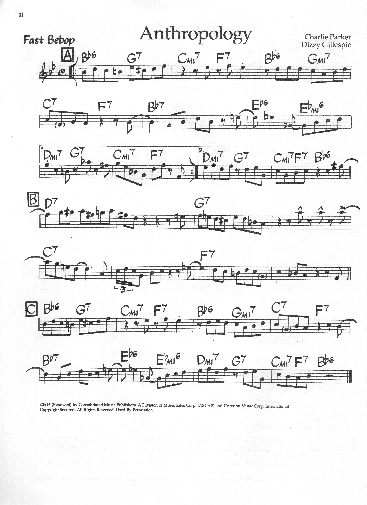

> [How To Jazz Guitar](<./How To Jazz Guitar.md>) / [6. Repertoire Lab](./06-Repertoire-Lab.md) / Anthropology

# 8. Rhythm Changes — Bird/BH Variation — B♭ Major — 32-Bar AABA (Anthropology)

**Concert:** Same form and key as 7, *embellished* with Harris `°7` passings. Same `A` but chromatic:

**Concert changes (A, Harris embellished, one per 2 beats — 8 chords where basic had 4):**
```
| B♭6  | B°7  | Cm6  | C°7  | F6? actually Dm7-ish → D°7 | ... → G7 scale |
| B♭6  | B°7  | Cm6  | C°7  | Dm6  | D°7  | G7   | G°7? |
```
Practically, insert `°7` between each diatonic step:
`B♭6 (3) → C°7 (5) → Cm6 (5?) → D°7 (7) → Cm6/E♭ → F°7 → G7 → G°7` — ascending `B♭6` scale `B♭ D F G + A°7` already *contains* the passing `°7`s.

**Bridge BH:**
```
| D7  | E♭°7 | G7  | A♭°7 | C7  | D♭°7 | F7  | G♭°7 |
```
Each `7` → its `°7` a half-step below, exactly `dim-6th-dominant.svg` dominant row `D7 5, G7 10, C7 8, F7 8?` plus `°7` at +2 frets.

**Why — the payoff:** This is *why* Chapter 5 exists — the `°7` is not an extra chord but the *other half* of the 6-dim scale. Hear `B♭6→Cm6` chromatic `G→Ab→A→Bb` voice-leading vs basic `B♭maj7→Cm7` diatonic leap. Same form, Harris sound.

**Map:** Use `dim-6th-major.svg` `B♭6` bottom-4 `E-A-D-G` root low-E `B♭1`? Actually `B♭6` at `6?` Check `dim-6th-major.svg:28` `G6 at 3`, so `B♭6` at `6` (`B♭ D F G` at `E6 A8 D7 G7` etc.), and `dim-6th-dominant.svg` dominant row for each `7` on bridge. Middle-4 `A-D-G-B` gives `B♭6 at A1` (open-ish).

**Scale:** Same as basic, but now every scale step is harmonized — solo with `B♭ major` scale, every note lands on `6` or `°7` — Harris half-step rule in situ.



---
← [Prev](./06-07-Oleo-Rhythm-Changes-Basic.md) · [Index](<./How To Jazz Guitar.md>) · [Next](<./How To Jazz Guitar.md>) →
